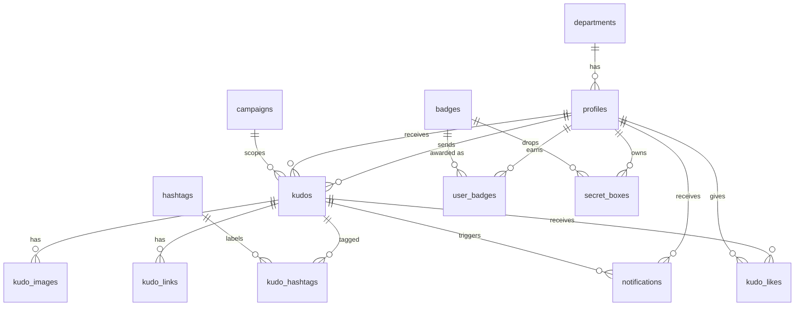

# Database Design — SAA Kudos

**Status:** v3 — `kudo_title_anonymous_name` migration applied (2026-06-11) · **DB:** PostgreSQL 17 (Supabase)
**Migrations:** `supabase/migrations/20260604070000_schema.sql`, `…070100_rls_policies.sql`, `…070200_functions_triggers_views.sql`, `20260606000000_kudo_likes.sql`, `20260611070000_kudo_title_anonymous_name.sql`; seed `supabase/seeds/common/seed.sql`.
**Resolved defaults:** secret-box grant via `grant_secret_box()` (admin/system; auto-grant rule TBD) · added `profiles.active_badge_id` (showcase title) · leaderboard ranks by `kudos_received` · single recipient · catalog single-language.
**Source:** MoMorph design (fileKey `9ypp4enmFmdK3YAFJLIu6C`) → analysis
`plans/reports/researcher-260604-1059-saa-kudos-design-analysis.md`
**Backend logic placement & full function bodies:**
`plans/260603-1716-nextjs-supabase-vercel-setup/data-model-and-backend-architecture.md`

Internal employee recognition app: users send Kudos (recognition messages) to colleagues,
earn Badges via random Secret Boxes, view a live board, leaderboard and profiles. Admins run
campaigns and moderate content.

---

## 1. Conventions

- **Naming:** `snake_case` tables (plural) and columns. Join tables: `<a>_<b>`.
- **Keys:** `uuid` (default `gen_random_uuid()`) for externally-referenced / unguessable rows
  (`profiles`=auth.users id, `kudos`, `secret_boxes`); `bigint generated always as identity`
  for internal catalog/child rows.
- **Timestamps:** every table has `created_at timestamptz not null default now()`.
- **Security:** RLS enabled on ALL tables from creation. Access via `auth.uid()` + role.
  Correctness-critical mutations go through `SECURITY DEFINER` functions, not direct DML.
- **Soft delete:** not used in v1 (YAGNI) — hard delete + FK cascade where it makes sense.
- **Enums:** modeled as `text` + `CHECK` (easier to evolve than PG enums).

---

## 2. ERD

> Note: `kudos` links to `profiles` twice (`sender_id`, `recipient_id`). `kudo_hashtags` is the
> M:N bridge between `kudos` and `hashtags`. `awards` is a standalone read-only catalog (no FK).

---

## 3. Domains & tables

### 3.1 Identity & Org

**`departments`**
| Column | Type | Constraints |
|--------|------|-------------|
| id | bigint identity | PK |
| name | text | NOT NULL, UNIQUE |
| created_at | timestamptz | NOT NULL default now() |

**`profiles`** (1:1 with `auth.users`; created on first login)
| Column | Type | Constraints |
|--------|------|-------------|
| id | uuid | PK, FK→auth.users(id) ON DELETE CASCADE |
| full_name | text | NOT NULL |
| email | text | NOT NULL |
| avatar_url | text | nullable |
| role | text | NOT NULL default `'member'`, CHECK in (`member`,`admin`) |
| department_id | bigint | FK→departments(id), nullable |
| created_at | timestamptz | NOT NULL default now() |

### 3.2 Taxonomy & Campaign

**`hashtags`** (admin-curated; 1–5 per kudo)
| id bigint PK · name text NOT NULL UNIQUE · created_at |

**`campaigns`** (recognition periods; drives prelaunch countdown + "Thể lệ" rules)
| Column | Type | Constraints |
|--------|------|-------------|
| id | bigint identity | PK |
| name | text | NOT NULL |
| rules_content | text | nullable (rich text) |
| starts_at | timestamptz | NOT NULL |
| ends_at | timestamptz | NOT NULL |
| is_active | boolean | NOT NULL default true |
| created_at | timestamptz | NOT NULL default now() |
| | | CHECK (ends_at > starts_at) |

### 3.3 Kudos

**`kudos`**
| Column | Type | Constraints |
|--------|------|-------------|
| id | uuid | PK default gen_random_uuid() |
| sender_id | uuid | NOT NULL, FK→profiles(id) |
| recipient_id | uuid | NOT NULL, FK→profiles(id) |
| title | text | nullable, max 100 chars (added 2026-06-11) |
| body | text | NOT NULL (HTML from Tiptap; max 10 000 chars raw) |
| is_anonymous | boolean | NOT NULL default false |
| anonymous_name | text | nullable — alias shown in place of sender name when `is_anonymous=true` (added 2026-06-11) |
| status | text | NOT NULL default `'published'`, CHECK in (`published`,`hidden`,`spam`) |
| campaign_id | bigint | FK→campaigns(id), nullable |
| created_at | timestamptz | NOT NULL default now() |
| | | CHECK (sender_id <> recipient_id) |

**Anonymous privacy rule:** `hydrateKudoCard` (server-side, `lib/kudos/`) replaces `sender_id` / `full_name` with `anonymous_name` for rows where `is_anonymous=true`, so the real sender is never leaked to the client.

**`kudo_hashtags`** (M:N) — `PK (kudo_id, hashtag_id)`; kudo_id FK ON DELETE CASCADE.
**`kudo_images`** — id PK · kudo_id FK CASCADE · storage_path text NOT NULL (≤5 enforced in `create_kudo`).
**`kudo_links`** — id PK · kudo_id FK CASCADE · url text NOT NULL · title text. ("Addlink Box")

### 3.4 Badges & Secret Box

**`badges`** (secret-box reward catalog)
| Column | Type | Constraints |
|--------|------|-------------|
| id | bigint identity | PK |
| name | text | NOT NULL UNIQUE |
| image_url | text | nullable |
| description | text | nullable |
| weight | integer | NOT NULL, CHECK (weight > 0) — drop probability weight |

Seed: Stay Gold 30 · Flow to Horizon 25 · Touch of Light 20 · Beyond Boundary 10 · Revival 10 · Root Further 5.

**`user_badges`** — id PK · user_id FK CASCADE · badge_id FK · source text default `'secret_box'` · created_at.

**`secret_boxes`**
| Column | Type | Constraints |
|--------|------|-------------|
| id | uuid | PK default gen_random_uuid() |
| user_id | uuid | NOT NULL, FK→profiles(id) CASCADE |
| status | text | NOT NULL default `'unopened'`, CHECK in (`unopened`,`opened`) |
| badge_id | bigint | FK→badges(id), nullable (set on open) |
| opened_at | timestamptz | nullable |
| created_at | timestamptz | NOT NULL default now() |

### 3.5 Kudo Likes

**`kudo_likes`** (heart reactions on kudos; one row per user per kudo — toggle model)
| Column | Type | Constraints |
|--------|------|-------------|
| id | bigint identity | PK |
| kudo_id | uuid | NOT NULL, FK→kudos(id) ON DELETE CASCADE |
| user_id | uuid | NOT NULL, FK→profiles(id) ON DELETE CASCADE |
| hearts | smallint | NOT NULL default 1, CHECK in (1, 2) — 2 = admin-granted special-day bonus |
| created_at | timestamptz | NOT NULL default now() |
| | | UNIQUE (kudo_id, user_id) |

**Replica identity:** `FULL` — required so Realtime DELETE payloads carry `kudo_id` + `user_id` (not just `id`), enabling board-side heart-count decrements.

### 3.6 Awards & Notifications

**`awards`** (read-only catalog — "Hệ thống giải", 6 categories; informational)
| id PK · category text NOT NULL · name text NOT NULL · description text · image_url text · sort_order int default 0 |

**`notifications`**
| Column | Type | Constraints |
|--------|------|-------------|
| id | bigint identity | PK |
| user_id | uuid | NOT NULL, FK→profiles(id) CASCADE (recipient) |
| type | text | NOT NULL (e.g. `kudo_received`) |
| kudo_id | uuid | FK→kudos(id) CASCADE, nullable |
| is_read | boolean | NOT NULL default false |
| created_at | timestamptz | NOT NULL default now() |

---

## 4. Indexes (beyond PK/unique)

| Table | Index | Purpose |
|-------|-------|---------|
| kudos | (recipient_id, created_at desc) | profile "received" feed |
| kudos | (sender_id, created_at desc) | profile "sent" feed |
| kudos | (status, created_at desc) | public board (published) |
| secret_boxes | (user_id, status) | count/open unopened boxes |
| notifications | (user_id, is_read, created_at desc) | unread bell |
| kudo_hashtags | (hashtag_id) | filter by hashtag |
| kudo_likes | (kudo_id) | aggregate heart counts per kudo |
| kudo_likes | (user_id) | user's like history |

---

## 5. RLS policy matrix

`is_admin()` = SECURITY DEFINER helper: `select exists(profiles where id=auth.uid() and role='admin')`.

| Table | SELECT | INSERT | UPDATE / DELETE |
|-------|--------|--------|-----------------|
| profiles | authenticated: all | self on signup | self (own row); admin |
| departments / hashtags / badges / awards / campaigns | all authenticated | admin | admin |
| kudos | `status='published'` OR own (sender/recipient) OR admin | **via `create_kudo()` only** (sender=auth.uid) | admin only (moderation) |
| kudo_hashtags / kudo_images / kudo_links | follows parent kudo | via `create_kudo()` | admin |
| secret_boxes | own only | grant path (TBD) / admin | **none direct — via `open_secret_box()`** |
| user_badges | all (public profile badges) | **via `open_secret_box()` only** | none |
| kudo_likes | all authenticated (heart counts are public) | own only; NOT on sender's own kudo | DELETE own only (unlike) |
| notifications | own | trigger (definer) | own (mark read) |

**Invariant:** `secret_boxes` and `user_badges` have NO direct user INSERT/UPDATE policy — mutated
only through `SECURITY DEFINER` functions. This makes the random reward tamper-proof.

---

## 6. Functions, triggers, views

(Full bodies in the backend-architecture doc; summary here.)

| Object | Type | Purpose |
|--------|------|---------|
| `create_kudo(p_recipient_id uuid, p_title text, p_body text, p_is_anonymous bool, p_hashtag_ids bigint[], p_image_paths text[], p_links jsonb, p_anonymous_name text)` | function (invoker) | Atomic insert of kudo + hashtags + images + links; validates 1–5 hashtags, ≤5 images, title ≤100 chars, body ≤10 000 chars. Grant: `authenticated`. Old 6-param signature removed (2026-06-11). |
| `open_secret_box(box_id)` 🔴 | function (definer) | Locks box (`FOR UPDATE`), weighted-random badge pick in SQL, awards `user_badges`, marks opened — one transaction. Server-authoritative, anti-cheat. |
| `notify_on_kudo` | trigger AFTER INSERT on kudos | Inserts a `kudo_received` notification for the recipient. |
| `is_admin()` | function (definer) | Role check used by RLS policies. |
| `user_statistics` | view | Per-user `kudos_received`, `kudos_sent`, `badges_count` for profile tiles / leaderboard. |
| `kudo_heart_counts` | view | Per-kudo `heart_total` (sum of `hearts`) and `like_count` (row count); consumed by board cards and realtime updates. |
| `profile_kudo_stats` | view | Per-profile `kudos_received`, `kudos_sent`, `hearts_received` (hearts on kudos sent by this profile); drives sidebar stats and spotlight sizing. |

**Realtime:** publish `kudos`, `notifications`, and `kudo_likes` to `supabase_realtime` (live board + bell + heart counts). `kudo_likes` uses `REPLICA IDENTITY FULL` so DELETE payloads carry full row data. RLS applies to realtime payloads.

---

## 7. Storage buckets
| Bucket | Visibility | Use |
|--------|-----------|-----|
| `avatars` | public read, owner write | profile pictures |
| `kudo-images` | authenticated read, write via Server Action | kudo attachments (≤5) |

Allowed mime: `image/png`, `image/jpeg`. (Local bucket `images` already defined in `config.toml`.)

---

## 8. Migration ordering

1. `departments`, `profiles`, `is_admin()`, profiles signup trigger
2. `hashtags`, `campaigns`
3. `kudos`, `kudo_hashtags`, `kudo_images`, `kudo_links` + indexes
4. `badges`, `user_badges`, `secret_boxes`
5. `awards`, `notifications` + index
6. RLS policies (all tables)
7. Functions: `create_kudo`, `open_secret_box`; trigger `notify_on_kudo`; view `user_statistics`
8. Realtime publication + storage buckets
9. Seeds (dev): departments, hashtags, badges, awards, sample profiles/kudos
10. `kudo_likes` table, indexes, RLS, views (`kudo_heart_counts`, `profile_kudo_stats`), replica identity, realtime publication (`20260606000000_kudo_likes.sql`)
11. `kudos.title` + `kudos.anonymous_name` columns; `create_kudo` re-created with 8-param signature; grant to `authenticated` (`20260611070000_kudo_title_anonymous_name.sql`)

---

## 9. Assumptions & open questions

**Assumptions (documented, change if wrong):**
- One department per user (`profiles.department_id` single FK). Switch to M:N join only if a user can belong to many.
- `awards` is purely informational (no winners relation).
- Anonymous kudos still store `sender_id` (hidden in UI), so moderation/stats work.
- Spam handling is manual (admin sets `status='spam'`); no auto-classifier.
- Google OAuth restricted to `@sun-asterisk.com` (enforced at auth layer).

**Open questions (block full schema finalization):**
1. **Secret box grant** — how do users earn boxes? (milestone trigger / admin grant / end-of-campaign job) → decides a trigger vs job vs admin flow.
2. Single vs multi recipient — confirmed **single** from design; re-confirm.
3. Do badges/titles display a "current title" on profile, or just a collection? (affects a possible `profiles.active_badge_id`)
4. Is the leaderboard ranked by received-kudos, badges, or a composite score?
5. Localization of catalog content (awards/rules) — currently single-language (i18n = UI only).
